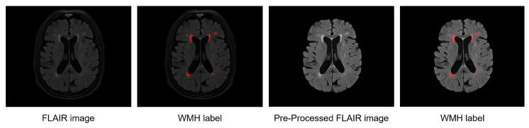
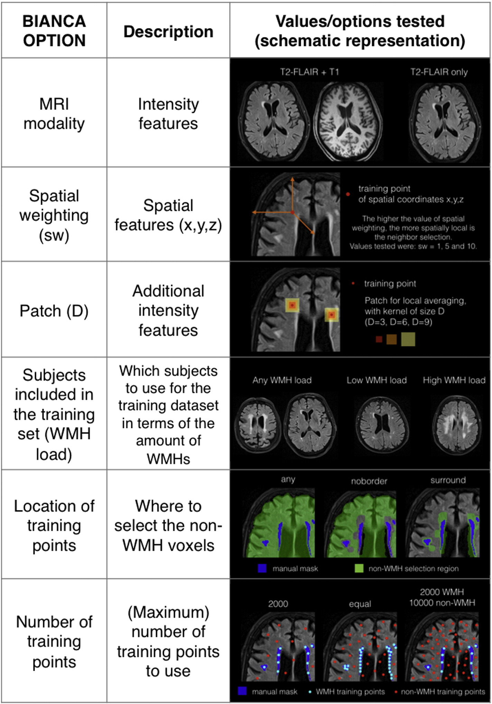
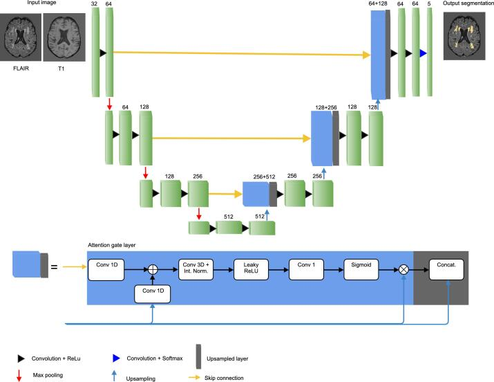
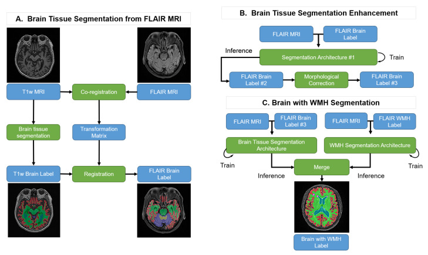

# White Matter Hyperintensity Segmentation (Background Study)

## Overview of WMH Segmentation  

White Matter Hyperintensities (WMHs) are regions of high intensity on certain MRI sequences (notably T2-weighted and FLAIR images) that indicate lesions or small vessel disease in the brain's white matter [1]. Clinically, WMHs are important biomarkers – their presence and volume correlate with aging, cerebrovascular disease, cognitive decline, and neurological disorders like multiple sclerosis (MS). Accurately quantifying WMH burden is crucial for diagnosis, tracking disease progression, and research into dementia and stroke. Yet WMH segmentation is challenging because these lesions vary greatly in size, shape, and location and can be confounded by other bright signals (e.g., blood vessels or imaging artifacts) [2]. Manual delineation by experts is time-consuming and subject to variability, thus there is demand for reliable automated WMH segmentation methods.

**Evolution of Methods:** Early approaches relied on conventional image processing and classic machine learning, including intensity-thresholding and region-growing techniques, often requiring extensive post-processing to exclude false positives. Subsequent methods introduced machine learning algorithms with hand-crafted features. For instance, the **BIANCA** tool (Brain Intensity AbNormality Classification Algorithm) uses a k-Nearest Neighbors classifier based on multi-modal MRI intensities and spatial features [2]. BIANCA achieved more consistent results and was reported as a reliable method in large studies [2]. Traditional ML methods faced generalizability challenges when applied to different scanners or protocols without retraining.

In recent years, deep learning approaches have become state-of-the-art for lesion segmentation. Convolutional Neural Networks (CNNs), especially U-Net architectures, substantially outperform traditional methods [3]. Modern deep learning pipelines often incorporate data augmentation, multi-sequence inputs, and ensemble strategies to maximize accuracy [4]. Hybrid models combining intensity-based and deep learning techniques have also emerged. For example, Van Huffel et al. (2021) described an approach pairing an unsupervised lesion detector with a 3D attention-gated U-Net, significantly improving lesion detection [3].

Ongoing challenges include class imbalance, standardizing results across scanners, and limited availability of expert-labeled data. Semi-supervised learning and domain adaptation research are tackling these issues [5].

  
**Figure 1:** Example FLAIR MRI slice (left) and the corresponding WMH segmentation (red mask, right). White matter hyperintensities appear as bright areas on FLAIR and are highlighted in red on the lesion mask. Automated segmentation methods aim to reproduce such masks to quantify WMH volume [5].

## Key Research References

### BIANCA – k-NN Based WMH Segmentation (Griffanti et al., 2016)  
**Summary:** *BIANCA* uses supervised *k*-nearest neighbors classification, learning from manually labeled MRI scans to predict lesions on new scans based on voxel intensity and location [2]. It allows multi-modal input and various feature options, achieving high correlation with expert segmentations. Griffanti et al. reported Dice overlap scores in the range of 0.7–0.8, concluding BIANCA is reliable for large studies [2].

<!--  -->

**Figure 2:** BIANCA options. List and brief description of the different options available with BIANCA tool and schematic representation of the different values tested in this study during the phase of algorithm optimisation. See main text for further details [2].

### icobrain ms 5.1 – Hybrid Unsupervised + Deep Learning (Van Huffel et al., 2021)  
**Summary:** Van Huffel et al. described icobrain ms 5.1, combining an unsupervised intensity-based method with a supervised deep learning 3D U-Net with attention gates. This hybrid approach improved lesion detection significantly, especially infratentorial lesions (14%) and juxtacortical lesions (31%) compared to older methods [3]. This combined approach leverages strengths of both methods, achieving robust segmentation performance.

**Figure 3:** Graphical representation of the attention-gate U-net used for segmentation and classification of the plaques. (Conv. – convolution, Int. Norm. – intensity normalization, Concat. – Concatenation, + – element-wise sum, × – matrix multiplication).

### Semi-Supervised Learning for WMH Segmentation (Rieu et al., 2021)  
**Summary:** Rieu et al. (2021) explored semi-supervised deep learning using proxy labels transferred from T1 MRI segmentation to FLAIR scans. This approach reduced the need for large labeled datasets, achieving WMH segmentation accuracy comparable to fully supervised methods [5]. This method effectively segments WMH using only FLAIR scans, enhancing accessibility and robustness for clinical datasets.

**Figure 4:** Pipeline of the proposed method. Blue boxes: input or output data; Green boxes: computational processes.

## References

[1] Hyperintensity. Wikipedia.

[2] Griffanti L, et al. BIANCA (Brain Intensity AbNormality Classification Algorithm): A new tool for automated segmentation of white matter hyperintensities. Neuroimage. 2016.

[3] Van Huffel S, et al. icobrain ms 5.1: Combining unsupervised and supervised approaches for improving the detection of multiple sclerosis lesions. NeuroImage: Clinical. 2021.

[4] White matter hyperintensities segmentation using the ensemble U-Net. NeuroImage. 2021.

[5] Rieu R, et al. Semi-Supervised Learning in Medical MRI Segmentation: Brain Tissue with White Matter Hyperintensity Segmentation Using FLAIR MRI. Brain Sciences. 2021.
