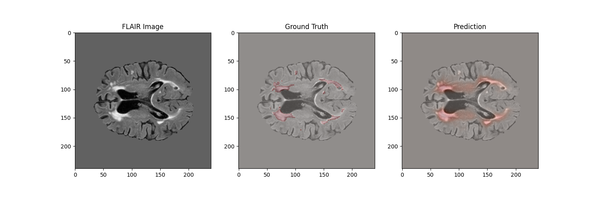

# SwitchSite - WMH Segmentation Project

A deep learning project for White Matter Hyperintensity (WMH) segmentation from brain MRI scans, with a focus on improving edge case detection and clinical workflow integration.

## Project Overview

This project implements an prototype WMH segmentation system with the following key features:
- MICCAI-2017 challenge dataset
- Preprocessing of FLAIR and T1 images using MONAI framework
- 3D U-Net baseline model
- Product development and competitor analysis

## Project Structure

- `0.background/` : Background research and literature review
- `1.data/` : Data preparation and preprocessing
- `2.baseline/` : Baseline model implementation
- `3.product/` : Product development and competitor analysis

## [Background Research](0.background/README.md)
Contains comprehensive research on WMH segmentation, including:
- Overview of WMH segmentation challenges
- Evolution of methods (traditional ML to deep learning)
- Review of key research papers (BIANCA, icobrain ms)

## [Data Processing](1.data/data_preparation.ipynb)

The data processing pipeline includes:
- Dataset download from MICCAI-2017 challenge
- Preprocessing of FLAIR and T1 images
- Data visualization tools

Key preprocessing steps:
- Skull stripping
- Intensity normalization
- Spatial resampling

## [Baseline Model](2.baseline/baseline_experiment.ipynb)
Implements a 3D U-Net architecture using MONAI framework:
- Multi-modal input (FLAIR + T1)
- Training/validation pipeline
- Baseline model pt file
- ~~Visualization tools~~
- ~~Comprehensive evaluation metrics~~

## [Product Development](3.product/README.md)
Detailed analysis of market landscape and product vision:
- Competitor analysis (NeuroQuant MS, icobrain MS)
- Core feature roadmap and product strategy

## Summary

This project demonstrates a prototype WMH segmentation system with a baseline model and a product development plan.
